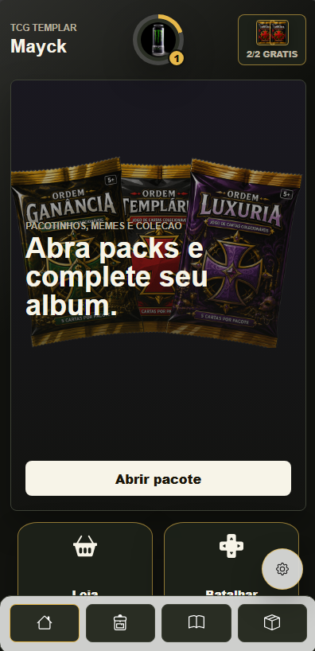

# ⚔️ TCG Templars

> Um jogo de cartas colecionáveis (Trading Card Game) desenvolvido para web, inspirado em mecânicas estratégicas de jogos de cartas, com sistema de progressão, coleções, heróis e batalhas.


---

## 🌐 Acesse o projeto

🔗 **https://tcg-templar.vercel.app/**

---

# 📖 Sobre

TCG Templars é um projeto pessoal desenvolvido com o objetivo de criar uma experiência completa de um jogo de cartas online.
Para fazer login é necessário um cadastro na TemplarChoice: https://templarchoice.vercel.app/

O projeto reúne autenticação de usuários, gerenciamento de coleção, abertura de pacotes, heróis, sistema de experiência e batalhas, servindo também como um laboratório para explorar arquiteturas modernas utilizando React, Supabase e Vercel.

---

# ✨ Funcionalidades

## 👤 Conta

- Cadastro
- Login
- Persistência de sessão
- Perfil do jogador

## 🎴 Cartas

- Coleção de cartas
- Diferentes raridades
- Visualização detalhada
- Sistema de pacotes

## 🎁 Pacotes

- Abertura animada
- Pacotes gratuitos diários
- Probabilidades de raridade

## ⚔️ Batalhas

- Batalhas contra CPU
- Sistema de energia
- Turnos
- Estratégia baseada em cartas

## ⭐ Progressão

- Sistema de XP
- Níveis
- Evolução do jogador

## 🦸 Heróis

- Loja de heróis
- Seleção de herói
- Sistema de desbloqueio

---

# 🖼️ Screenshots

## Tela Inicial



---

## Coleção


---

## Batalha


---

## Loja


---

# 🛠 Tecnologias

### Front-end

- React
- JavaScript
- CSS
- Vite

### Back-end

- Supabase
- PostgreSQL

### Deploy

- Vercel

### Ferramentas

- Git
- GitHub
- Figma
- VS Code

---

# 🏗 Arquitetura

```
Usuário
    │
React
    │
Supabase Auth
    │
PostgreSQL
```

---

# 📂 Estrutura do Projeto

```
src/
 ├── components
 ├── pages
 ├── contexts
 ├── hooks
 ├── services
 ├── assets
 ├── styles
 └── utils
```

---

# 🚀 Roadmap

## ✅ Concluído

- Sistema de autenticação
- Coleção de cartas
- Pacotes
- Perfil
- Loja de heróis
- Sistema de XP
- Deploy

## 🚧 Em desenvolvimento

- Estatísticas
- Melhorias na IA
- Animações
- Interface aprimorada

## 🔮 Futuro

- PvP Online
- Ranking
- Matchmaking
- Conquistas
- Missões
- Mercado
- Guildas
- Eventos
- Aplicativo Mobile

---

# 🎯 Objetivos

Este projeto foi criado para praticar e consolidar conhecimentos em:

- Arquitetura Front-end
- Gerenciamento de estado
- Banco de dados
- Autenticação
- Consumo de APIs
- Deploy
- Organização de código
- Desenvolvimento de aplicações escaláveis

---

# 📈 Status

O projeto continua em desenvolvimento e novas funcionalidades são adicionadas continuamente.

---

# 👨‍💻 Autor

**Emanuel Saga**

- LinkedIn
- GitHub
- Portfólio

---

# 📄 Licença

Este repositório tem fins educacionais e de portfólio.
